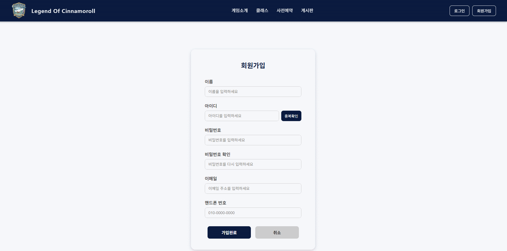
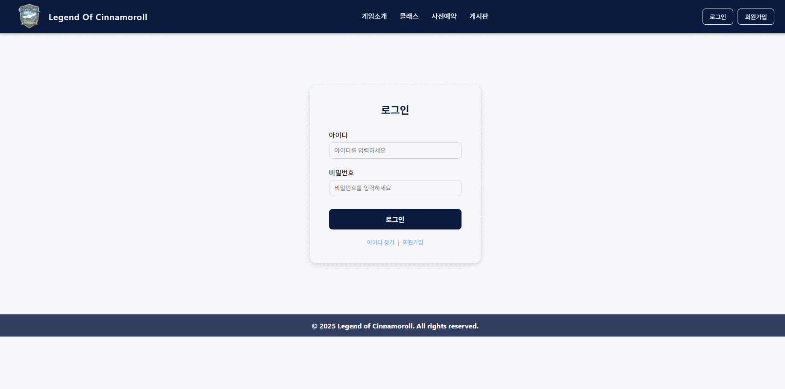
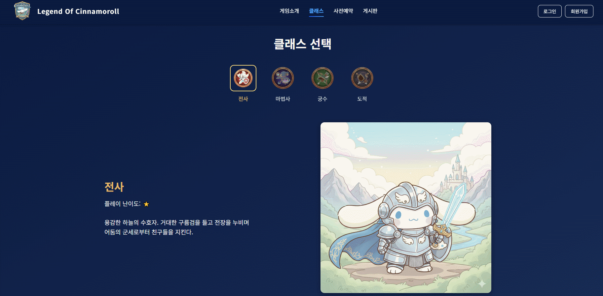
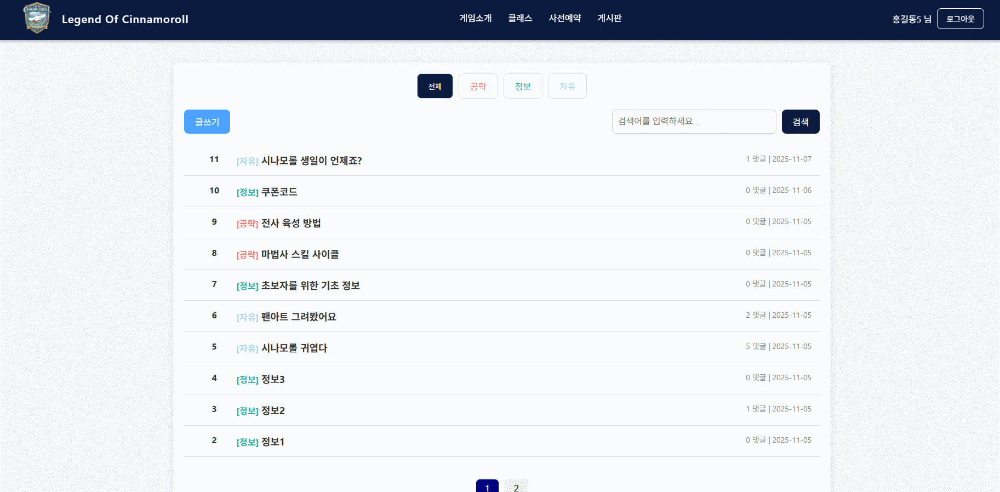

# LOfCinna (Community Board Service)


## 📸 스크린샷

<table>
<tr>
<td>

### 메인페이지


</td>
<td>

### 회원가입


</td>
</tr>

<tr>
<td>

### 로그인


</td>
<td>

### 게임소개


</td>
</tr>

<tr>
<td>

### 클래스


</td>
<td>

### 사전예약


</td>
</tr>

<tr>
<td>

### 게시판


</td>
<td>

### 


</td>
</tr>
</table>

## 📖 프로젝트 소개
**LOfCinna**는 사용자들이 자유롭게 소통하고 정보를 공유할 수 있는 커뮤니티 게시판 서비스입니다.
안정적인 회원 관리 시스템과 직관적인 게시판 기능을 통해 사용자 경험을 최적화하였으며, Spring Boot와 MyBatis를 활용하여 데이터 처리의 효율성을 높였습니다.

### 🎯 개발 목표
-   **안정성**: Spring Security를 도입하여 안전한 로그인 및 회원가입 프로세스 구축
-   **확장성**: MVC 패턴을 준수하여 유지보수가 용이한 코드 구조 설계
-   **사용자 편의성**: 카테고리별 조회, 검색 기능, 댓글 시스템을 통해 활발한 커뮤니티 환경 조성


---

## 🛠️ 기술 스택 (Tech Stack)

| 구분 | 기술 (Technology) | 설명 |
| --- | --- | --- |
| **Language** | Java 21 | 최신 LTS 버전 활용 |
| **Framework** | Spring Boot 3.5.7 | 빠르고 간편한 설정 및 배포 |
| **Database** | MySQL 8.0 | 관계형 데이터베이스 관리 |
| **ORM** | MyBatis 3.0.5 | SQL 매핑 프레임워크 사용 |
| **Frontend** | Thymeleaf, HTML/CSS/JS | 서버 사이드 렌더링(SSR) 및 UI 구현 |
| **Security** | Spring Security | 인증(Authentication) 및 인가(Authorization) 처리 |

---

## ✨ 핵심 기능 (Key Features)

### 1. 회원 관리 시스템 (Authentication)
*   **회원가입 및 로그인**: Spring Security의 `PasswordEncoder`를 사용하여 비밀번호를 암호화하여 저장.
*   **보안**: CSRF 공격 방지 및 세션 관리 적용.

### 2. 게시판 (Board)
*   **CRUD 기능**: 게시글 작성, 조회, 수정, 삭제 기능 완벽 구현.
*   **카테고리 분류**: 공략(guide), 정보(info), 자유(free) 등 카테고리별 게시글 필터링.
*   **페이징(Pagination)**: `OFFSET`과 `LIMIT`을 활용한 효율적인 데이터 조회 및 페이지 네비게이션 UI 제공.
*   **검색(Search)**: 제목 및 내용 기반의 키워드 검색 기능 (`LIKE` 쿼리 활용).

### 3. 소통 및 파일 관리
*   **댓글 시스템**: 게시글에 대한 댓글 작성 및 삭제 기능
*   **파일 업로드**: 이미지 및 첨부파일 업로드 기능 지원

---

## 🚀 문제 해결 및 학습 (Troubleshooting & Learning)

### 🔹 페이징 처리 최적화
*   **문제**: 게시글 수가 늘어남에 따라 전체 데이터를 한 번에 조회하는 것은 성능 저하를 유발함.
*   **해결**: MyBatis `LIMIT`, `OFFSET`을 사용하여 페이지당 필요한 데이터만 가져오도록 쿼리를 최적화함. 또한 프론트엔드에 현재 페이지, 시작 페이지, 끝 페이지 정보를 전달하여 직관적인 UI를 구성함.

### 🔹 동적 쿼리(Dynamic Query) 활용
*   **상황**: 검색 조건(키워드)이나 카테고리 필터 유무에 따라 SQL이 달라져야 함.
*   **해결**: MyBatis의 `<if>` 태그를 활용하여 조건에 따라 `WHERE` 절이 동적으로 변경되도록 구현. 이를 통해 코드 중복을 줄이고 유지보수성을 높임.

---

## 📦 설치 및 실행 방법 (Installation)

1. **프로젝트 클론**
    ```bash
    git clone https://github.com/your-username/LOfCinna.git
    cd LOfCinna
    ```

2. **데이터베이스 설정**
    *   `src/main/resources/application.properties` 파일에서 DB 연결 정보를 본인 환경에 맞게 수정합니다.
    ```properties
    spring.datasource.url=jdbc:mysql://localhost:3306/lofcinna?useSSL=false&allowPublicKeyRetrieval=true
    spring.datasource.username=root
    spring.datasource.password=yourpassword
    ```

3. **빌드 및 실행**
    ```bash
    ./gradlew bootRun
    ```

4. **접속**
    *   브라우저에서 `http://localhost:8080` 으로 접속합니다.
